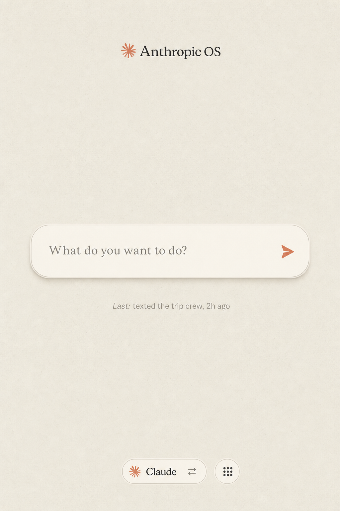
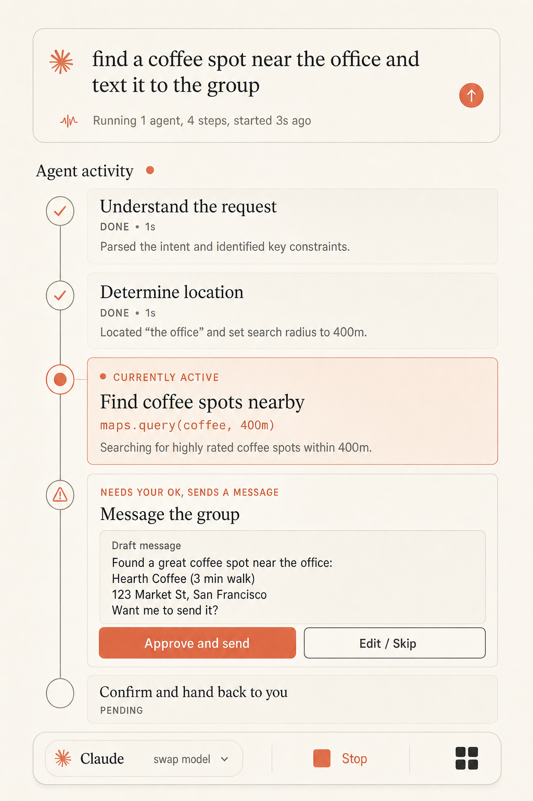
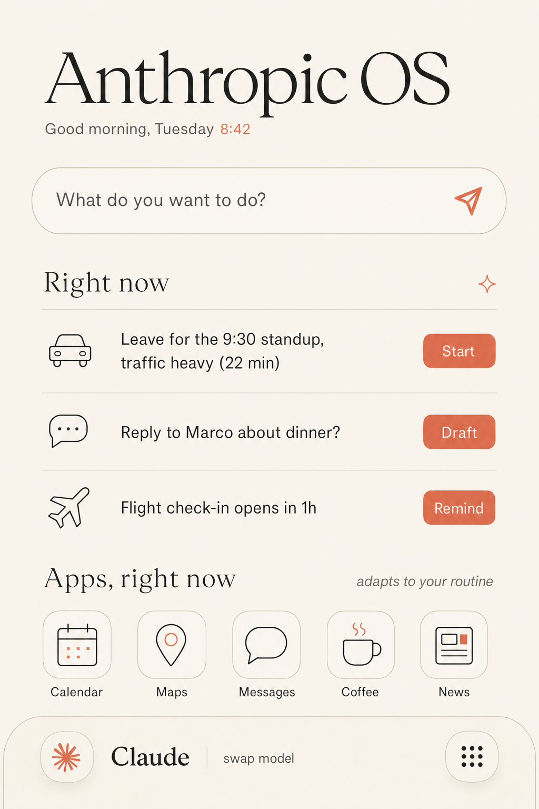

# Anthropic-Mobile-OS — Locked Design Direction (the goal)

Approved 2026-06-22. Theme: **Anthropic warm**. Aspect: vertical mobile (1024x1536).

## Palette
- Paper / background: `#F0EEE6` (warm cream / ivory)
- Text: `#1F1F1C` (warm near-black slate)
- Accent (single): `#D97757` (Anthropic "Claude" coral / clay)
- Monospace: ONLY for the agent's raw "thinking" lines.

## Canonical screens

### 1. Idle home — Milestone 0

The calm resting face. The intent input "What do you want to do?" is the single hero;
one faint recent-activity line; the bottom bar is a "Claude / swap model" pill + the
app-grid fallback. Vast negative space, one anchor.

### 2. Active narration feed — Milestone 0

The trust surface. A vertical timeline of agent steps; done steps muted with a coral
check; the currently-active step is the anchor with its monospace thinking line and a
live indicator; the high-side-effect step shows an inline "Approve & send / Edit · Skip"
confirm; Stop + app-grid in the bottom bar. The feed must redact secrets.

### 3. Predictive home — v1 (not Milestone 0)

The populated, proactive home: the agentic intent input, a "Right now" list of predicted
actions each with its own quick action (Start / Draft / Remind), and an "adapts to your
routine" app row that reorders for the moment. This is the v1 ambient/proactive target;
Milestone 0 ships the calm idle home above.

## Rules carried from the design review
- 48dp touch targets; body text >= 16px; contrast >= 4.5:1.
- `aria-live="polite"` on the ACTIVE narration step only (don't flood screen readers).
- Confirm actions in the bottom thumb-zone.
- One coral accent; no purple; no dark background; no generic card / icon grid.
- Pin the full type scale / spacing / motion via a design system (DESIGN.md).
